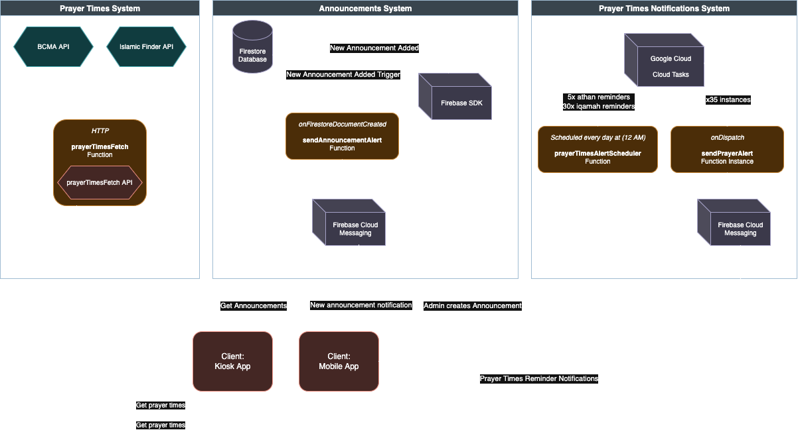

# Kelowna Islamic Center Application Architecture

The KIC ecosystem is built as a **modular, event-driven system** with the following key characteristics:

* **Serverless backend** powered by Firebase Cloud Functions, handling notifications, prayer times, and announcements.
* **Real-time synchronization** of announcements via Firestore, ensuring all client apps stay automatically up to date.
* **Cross-platform frontends**:
    * **Flutter Mobile App** for community members (Android/iOS)
    * **Web Kiosk App** for Masjid display screens

---

## High-Level Components

### Firebase Cloud Functions (Server-Side)

Cloud Functions serve as the backend layer, managing all server-side logic.
They interact with Firestore, Firebase Cloud Messaging (FCM), and external APIs (such as BCMA and Islamic Finder), providing clean and easily controlable data for the clients.

### Clients (Mobile App, Kiosk App)

The clients are the user-facing applications: the mobile app and the kiosk app.
Both connect exclusively through Firebase services such as Cloud Functions, Firestore, and FCM, keeping the front-end architecture lightweight and maintainable.

---

## Architecture Diagram

The overall architecture is illustrated below:

The diagram may seem complex at first, but as you read through the rest of the documentation, it will become increasingly easier to understand.
