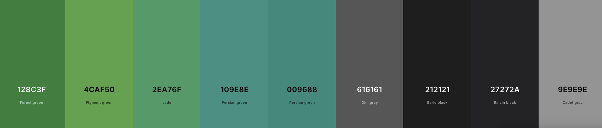

# Design Language & Accessibility Guidelines

To ensure consistency, usability, and inclusivity across all KIC applications, the following unified design language must be followed. This design language defines how applications look, feel, and interact with users, while prioritizing accessibility and legibility for all members of the community.

This goes hand in hand with the internationalization requirement mentioned in the previous page.

---

## Core Design Principles

1. **Masjid Color Palette**  
   All apps and user interfaces should consistently use the Masjid’s color palette for all UI elements. This is the standard material design green colour palette that is natively included with Flutter. The colour code values can the found in the following diagram or on [Coolors](https://coolors.co/128c3f-4caf50-2ea76f-109e8e-009688-616161-212121-27272a-9e9e9e).

    You can use additional material design colours or variations however try to use this colour palette for the primary colours in all masjid designs.

    

2. **Dark Mode Support**  
   Dark mode is a requested feature from the community and must be supported in all applications:
    - Respect system-wide dark mode preferences where possible.  
    - Provide a manual toggle option for apps where appropriate. If not possible, prioritize dark mode over a lighter mode (for example the kiosk app is dark mode only)
    - Ensure color choices maintain readability and proper contrast in both light and dark themes.

3. **UI Scaling & Responsiveness**  
   Apps must scale properly across different screen sizes and resolutions:
    - **Mobile App** → must adjust to varying device resolutions and follow device-level accessibility scaling (dont hard code scaling values).  
    - **Kiosk App** → must dynamically adjust to large-screen displays in the Masjid hall. Text and critical information must remain legible from the end of the prayer hall.  

4. **Consistency Across Platforms**  
   Visual elements, such as buttons, typography, and layout, should follow a consistent design pattern to make switching between mobile and kiosk apps seamless for users. There is no official guide for this but the general rule is to follow [Material design](https://m3.material.io/) (the default for the mobile app) as it is simple to implement.

---

## Accessibility Standards

Accessibility is not optional, it is a requirement as a lot of the community consists of older users who need accessiblity features to continue using the applications.

1. **Contrast & Legibility**
    - Ensure sufficient contrast between text and background in both light and dark modes.  
    - Text must remain legible even in bright lighting conditions within the Masjid hall (Duhr time when the prayer hall is very bright).  
    - Avoid using light gray text on white or dark gray text on black.  

2. **Avoid Visual Overload**
    - Minimize the use of multiple colors, patterns, or heavy backgrounds.
    - Use a clean, minimal design to ensure readability at a distance (especially in kiosk app which is often viewed from the end of the hall).  

3. **Scalable Typography**
    - All text within the mobile app should support dynamic scaling to respect accessibility preferences (e.g., larger font settings scale all the text in the app).  
    - Kiosk app text should be large and bolded so it visible from across the hall.
