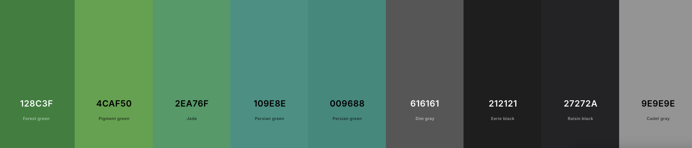

# Design Language & Accessibility Guidelines

To ensure consistency, usability, and inclusivity across all KIC applications, the following unified design language must be followed. This design language defines how applications look, feel, and interact with users while prioritizing accessibility and legibility for all members of the community.

This goes hand in hand with the internationalization requirements mentioned on the previous page.

## Core Design Principles

### Masjid Color Palette

All apps and user interfaces should consistently use the Masjid's color palette for all UI elements. This is the standard Material Design green color palette that is natively included with Flutter. The color values can be found in the following diagram or on [Coolors](https://coolors.co/128c3f-4caf50-2ea76f-109e8e-009688-616161-212121-27272a-9e9e9e).

You can use additional Material Design colors or variations; however, try to stay within this color palette for the primary colors in all Masjid designs.

### UI Scaling & Consistency Across Platforms

Apps must scale properly across different screen sizes and resolutions.

The Mobile App must adjust to varying device resolutions and follow device-level accessibility scaling (don't hard-code scaling values). This also includes automatic adjustment for foldable Android devices and iPads running iPadOS.

The Kiosk App must support both vertical and horizontal displays with dynamic layout adjustments. Since text and critical information must remain legible from the back of the prayer hall, text should be bold and kept large. Moving text, such as carousel announcements, must remain on screen for at least 20 seconds (longer for longer announcements) to allow slower readers sufficient time to read the full announcement.

Visual elements, such as buttons, typography, and layout, should follow a consistent design pattern to make switching between the Mobile App and Kiosk App seamless for users. There is no official design guide for this; however, the general recommendation is to follow [Material You](https://m3.material.io/) (the default design system used by the Mobile App), as it is simple to implement and provides good accessibility.

### Dark Mode Support

Dark mode is a requested feature from the community and must be supported in all applications. This means respecting system-wide dark mode preferences where possible and providing manual theme toggles where appropriate.

If this is not possible, prioritize dark mode over a light theme (for example, the Kiosk App is dark-mode only). Regardless of the theme, ensure that color choices maintain readability and sufficient contrast.

## General Rules for Accessibility

Accessibility is not optional; it is a requirement, as much of the community consists of older users who rely on accessibility features to continue using the applications.

1. Contrast & Legibility
    * Ensure sufficient contrast between text and background in both light and dark modes.
    * Text must remain legible even in bright lighting conditions within the Masjid prayer hall (for example, during Dhuhr when the hall is brightly lit).
    * Don't use light gray text on white backgrounds or dark gray text on black backgrounds.

2. Avoid Visual Overload
    * Minimize the use of multiple colors, patterns, or heavy backgrounds.
    * Use basic sans-serif fonts. Do not use decorative serif or display fonts that become illegible from a distance.
    * Use a clean, minimal design to ensure readability at a distance, especially in the Kiosk App, which is often viewed from the back of the prayer hall.

3. Scalable Typography
    * All text within the Mobile App should support dynamic scaling to respect accessibility preferences (e.g., larger system font settings should scale all text in the app).
    * Text in the Kiosk App should be large and bold so it remains visible from across the prayer hall.
